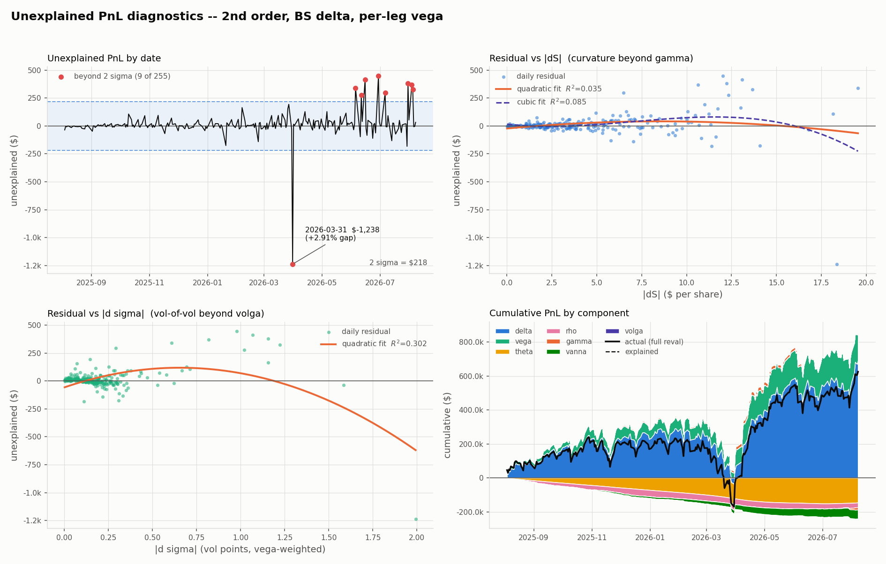
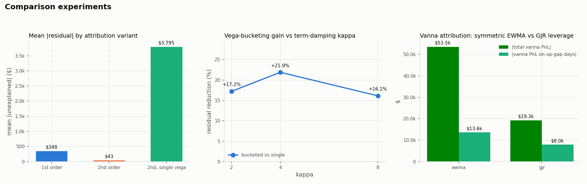

# Option Portfolio PnL Explain Engine

> **Archived — this project now lives in
> [MeilinP/derivatives-pricing-risk](https://github.com/MeilinP/derivatives-pricing-risk)**
> as the `attribution/` module (plus the `risk/` module built on it), merged with the SOFR curve bootstrap and the SABR
> calibration it depends on. Development continues there; this repository is
> kept read-only for its history.

Decomposes the daily PnL of a SPY option book into Greek contributions, measures
the unexplained residual, and uses the residual's *shape* to diagnose which term
the model is missing. Volatility comes from the SABR calibration in Project 1;
discounting comes from the bootstrapped SOFR OIS curve in Project 2.



*Second-order attribution, BS delta, per-leg vega. Mean unexplained PnL is **$43** against
$22,031 mean absolute daily PnL (R² 0.99999); 9 of 255 days fall beyond 2σ, and the single
worst is the +2.91% gap on 2026-03-31.*



*Left to right: mean |residual| by attribution variant ($348 first order → $43 second order,
and $3,795 when vega is collapsed to a single bucket); the vega-bucketing gain against the
term-damping κ; and vanna attribution under symmetric EWMA vs GJR leverage.*

```bash
python run.py                # full pipeline: data + all five experiments
python run.py --stage data   # market data, surface and exposures only
python run.py --live         # re-pull yfinance instead of the cached snapshot
python tests/test_sanity.py  # 15 invariant checks
```

Dependencies: `numpy`, `scipy`, `pandas`, `matplotlib`, `yfinance`.

---

## 1. Headline results

| metric | value |
|---|---|
| underlying / window | SPY, 2025-08-01 → 2026-08-07 (256 days, **255 daily moves**) |
| spot path | 621.72 → 773.26 (+24.4%); 695 → 632 drawdown in Mar-2026 |
| gap days \|ΔS/S\| > 2% | **5** (−2.70%, −2.58%, −2.04%, +2.55%, +2.91%) |
| book | long straddle, short strangle, call spread, calendar — 8 legs |
| daily PnL, std / mean abs | $29,827 / $22,031 |
| mean unexplained, 1st order | $348 — **1.58%** of daily abs PnL, R² 0.99923 |
| mean unexplained, 2nd order | $43 — **0.196%** of daily abs PnL, R² 0.99999 |
| **residual reduction, 2nd order** | **−87.6%** |
| largest residual day | **2026-03-31**, +2.91% gap: residual −$1,238 on $140,962 actual (0.88%) |
| FRTB | **PASS** on all 11 variants (worst variance ratio 5.4% vs 20% limit) |
| vega bucketing gain | **−21.9%** residual (single $3,795 → bucketed $2,965) |
| SABR delta, hedge std | **−39.3%** vs BS delta ($5,454 → $3,311) |

Sources actually used at run time (each output carries the stamp):
`sofr-curve` for discounting (21 pillars, 0.025y–40y, zeros 3.30%–3.82%),
`sabr-calibration` for vol (8 expiries, T 0.115–2.357y). Neither fallback fired.

---

## 2. The five experiments

### 2.1 First order vs second order — the second-order terms are worth 87.6%

Vega treatment held at per-leg exact, delta at Black-Scholes.

| variant | mean \|residual\| | std | % of abs PnL | R² |
|---|---|---|---|---|
| 1st order (Δ, ν, Θ, ρ) | $348 | $787 | 1.58% | 0.99923 |
| 2nd order (+ Γ, vanna, volga) | **$43** | $109 | **0.196%** | 0.99999 |

**−87.6%** on mean absolute residual, **−86.2%** on its standard deviation.
Gamma does most of that work: the book's gamma swings between −37.8 and +39.5
and changes sign 19 times, so a first-order model is wrong in both directions
across the window rather than carrying a constant bias.

### 2.2 BS delta vs SABR delta — the attribution says one thing, the hedge says another

| delta | attribution residual | hedge-PnL std | vs BS |
|---|---|---|---|
| Black-Scholes | **$43** | $5,454 | — |
| SABR | $152 | **$3,311** | **−39.3%** |
| Bartlett | $328 | $6,943 | +27.3% (worse) |

These two columns disagree, and the reason is the point of the experiment.

A SABR delta already contains the vol move the smile produces when spot moves,
`Δ_SABR = Δ_BS + ν·∂σ/∂S`. Charging the vega term with the full realised Δσ on
top of that double-counts, so the SABR variants use
`Δσ_eff = Δσ − (∂σ/∂S)·ΔS`. Once that correction is made the two variants agree
to first order in ΔS and differ only through the *curvature* of σ(S) — so in an
attribution fed exact per-leg vol marks, the SABR delta can only lose: it
replaces an exactly-known quantity with its linearisation. That is why its
residual is 3.5× the BS one, and it is an artefact of the test, not a defect of
the delta.

The test that does discriminate is hedge-PnL variance, which is what Bartlett's
delta was introduced to win: a hedge cannot quietly absorb a bad delta into a
vega term. There the SABR delta cuts the std of daily delta-hedged PnL by
**39.3%** against Black-Scholes. **Reported metric matters more than the delta
does** — this is the single most transferable result in the project.

Bartlett's delta *underperforms* both. That is not a bug; see §2.4.

### 2.3 Single vega vs bucketed vega — bucketing recovers 21.9%

Delta held at BS, order at second. Bucket vegas are bump-and-reprice (one vol
point per bucket, other buckets fixed), not summed analytic leg vegas.

| vega treatment | mean \|residual\| | % of abs PnL | R² | vs single |
|---|---|---|---|---|
| single (total vega × 3M ATM Δσ) | $3,795 | 17.2% | 0.9461 | — |
| bucketed (4 buckets × own ATM Δσ) | $2,965 | 13.5% | 0.9665 | **−21.9%** |
| exact (per-leg ν × per-leg Δσ) | $43 | 0.20% | 0.99999 | −98.9% |

Bucketing closes **22.1%** of the single→exact gap. The book shows why a single
number is not actionable: on 2026-04-07 its bucket vegas are +30,085 / −41,536 /
+32,499 per vol point across 3M-6M / 6M-1Y / 1Y+, against a parallel total of
just +21,049. They largely cancel, so the single number reports a modest
long-vega book while the ladder reports a large calendar position that any
non-parallel vol move will hit.

**Do bucket vegas sum to total vega?** Here, exactly — mean discrepancy $0.0000,
0.000% of mean total vega. This is **true by construction and is not a finding**:
each leg sits in exactly one bucket, so the bumps touch disjoint legs, and the
central difference cancels the even-order (volga) term. A surface model in which
one bucket's bump leaked into a neighbouring expiry would show a non-zero
interaction; this one structurally cannot.

### 2.4 Sensitivity A — symmetric EWMA vs GJR leverage

Both variants are anchored to λ = 1 on the calibration date, so they share an
unconditional vol level and differ only in response asymmetry.

| | symmetric EWMA | GJR (γ = 0.5) |
|---|---|---|
| mean \|residual\| | $43.21 | $43.94 (+1.7%) |
| total vanna PnL | −$53,531 | **−$19,254** |
| vanna PnL on up-gap days | −$13,618 | **−$7,960** |
| mean \|residual\| on gap days | $379 | $620 |
| Bartlett hedge std | $6,943 | **$5,716 (−17.7%)** |

**The total residual is indifferent to the asymmetry (+1.7%) but the vanna
attribution is not — it falls by 64%.** That separation is the result. A
symmetric EWMA is blind to the sign of the return, so a +2.91% rally raises
modelled vol exactly as a −2.91% selloff would. Since vanna PnL is
`vanna·ΔS·Δσ`, the symmetric variant books a large vanna contribution on up-gap
days that has the wrong economic sign. The Taylor sum still lands in the right
place — the error is *inside* the decomposition, redistributed between terms.
**A clean total residual is not evidence that the individual Greek attributions
are right**, which is precisely what a desk uses this report to decide.

This also explains Bartlett's poor showing in §2.2. Bartlett's delta assumes
`dα = ρ·ν·F^(−β)·dF` with ρ < 0 — that is, it *assumes a leverage effect*. Under
the symmetric EWMA the surface has none, so the assumption is false and the
correction pushes the delta the wrong way. Introducing the leverage effect via
GJR improves Bartlett's hedge std by **17.7%**, exactly as that reasoning
predicts. It still trails the plain SABR delta ($5,716 vs $3,498), so on this
surface Bartlett over-corrects — but the *direction* of the sensitivity confirms
the mechanism rather than leaving it asserted.

### 2.5 Sensitivity B — vega-bucketing gain vs the damping parameter κ

| κ | single | bucketed | exact | bucketing gain |
|---|---|---|---|---|
| 2 | $3,765 | $3,117 | $50 | **+17.2%** |
| **4 (baseline)** | $3,795 | $2,965 | $43 | **+21.9%** |
| 8 | $3,392 | $2,845 | $43 | **+16.1%** |

**The conclusion does not flip.** Bucketing reduces the residual at every κ
tested, the sign is stable, and the gain stays in a 16–22% band. The
experiment therefore *does* support its conclusion, with the honest caveat that
the magnitude is κ-dependent to about ±6 percentage points and is not monotone
in κ — the baseline κ = 4 happens to be the most favourable of the three, so
**21.9% should be read as the top of a 16–22% range, not as a point estimate.**
Had the sign flipped, the finding would have been reported as non-conclusive;
`run.py` tests for that explicitly and prints
`CONCLUSION STABLE ACROSS KAPPA: YES/NO`.

---

## 3. Residual diagnostics

`output/residual_diagnostics.png` — residual time series with ±2σ bands
(9 of 255 days outside), residual vs |ΔS| and vs |Δσ| with polynomial fits, and
the cumulative decomposition by component.

**Every polynomial fit is reported twice: full sample, and excluding the single
worst day (2026-03-31).** That day is an extreme leverage point and it inverts
the reading:

| fit | full sample R² | excl. worst day R² |
|---|---|---|
| residual vs \|ΔS\| — linear | 0.009 | **0.163** |
| residual vs \|ΔS\| — quadratic | 0.035 | 0.195 |
| residual vs \|ΔS\| — cubic | 0.085 | 0.197 |
| residual vs \|Δσ\| — linear | 0.000 | 0.277 |
| residual vs \|Δσ\| — quadratic | 0.302 | 0.287 |
| residual vs \|Δσ\| — cubic | 0.778 | **0.537** |

Read on the full sample alone one would report a cubic |ΔS| pattern (missing
speed, ∂³V/∂S³) and a quadratic |Δσ| pattern. Both readings are driven by one
observation. On the robust sample:

- **vs |ΔS|: predominantly linear** (0.163), with quadratic adding 0.03 and
  cubic adding 0.003. There is *no* meaningful speed signal — gamma plus vanna
  already absorb the spot dimension.
- **vs |Δσ|: a genuine cubic component** (0.287 → 0.537, +0.25 from the cubic
  term alone, surviving the outlier drop). The missing term is third-order in
  vol — ultima, ∂³V/∂σ³ — not more spot curvature.

**Diagnosis: the model's deficiency is in the vol dimension, not the spot
dimension.** Volga is not enough; the next term to add is ultima, not speed.

**Worst day.** 2026-03-31, the +2.91% gap out of the March drawdown: actual
PnL $140,962, explained $142,200, residual **−$1,238** (0.88% of the day's PnL,
5.7× the window's 2σ band of $218). Book gamma was +39.5, its window maximum, and
the second-order term over-states the move — the classic signature of a
Taylor expansion evaluated at t₀ on a move large enough that the Greeks
themselves have moved by the close. Full table in `output/worst_days.csv`.

## 4. FRTB-style attribution test

Three Basel PLA metrics comparing risk-theoretical PnL (Greek explanation) to
hypothetical PnL (full revaluation). Thresholds: |mean ratio| ≤ 10%, variance
ratio ≤ 20%.

| variant | mean ratio | variance ratio | Spearman | result |
|---|---|---|---|---|
| 1st order | −0.85% | 0.07% | 1.0000 | PASS |
| 2nd order | 0.05% | 0.00% | 1.0000 | PASS |
| delta = SABR | −0.48% | 0.01% | 1.0000 | PASS |
| delta = Bartlett | 1.10% | 0.06% | 1.0000 | PASS |
| vega = single | 0.20% | **5.39%** | 0.9948 | PASS |
| vega = bucketed | 0.58% | 3.35% | 0.9965 | PASS |
| coarse (1st order + single vega) | 0.15% | 4.26% | 0.9971 | PASS |

**All eleven variants pass**, including the deliberately coarse desk variant
(one vol number, no second-order terms). A desk failing these must use the
standardised approach instead of an internal model, which materially increases
its capital requirement.

The honest caveat: **passing here is close to guaranteed and does not validate
the framework.** Full revaluation and the Greeks are computed from the *same*
two-state-variable surface (spot and one vol level factor), so the hypothetical
PnL is an analytic function of exactly the variables the Taylor expansion
differentiates. Real PLA failures come from sources this setup does not contain
— intraday rebalancing, bid/ask, stale marks, and risk factors present in the
reval model but absent from the sensitivities. The variance ratio only becomes
non-trivial (5.4%) once the vol input is deliberately coarsened, which is the
useful signal in the table: **the vol-mark granularity, not the Taylor order, is
what would put this book near a regulatory threshold.**

---

## 5. Modelling choices — and the alternative rejected at each

### 5.1 Vol surface evolution — the load-bearing approximation

**Project 1 calibrated on a single date (2026-08-07). A one-date calibration
cannot be evolved without an assumption, and this is it:**

- **ρ(T) and ν(T) are held FIXED through time**, interpolated in maturity onto
  whatever T each option has on a given date. There is no second calibration
  from which to evolve their shape.
- **The ATM term structure is anchored on the calibrated ATM curve and scaled
  daily by realized vol:**
  ```
  λ_t = RV_t / RV_calibration
  σ_ATM(t, T) = σ_ATM_cal(T) · [1 + (λ_t − 1)·w(T)]
  w(T) = (1 − e^(−κT)) / (κT),  κ = 4
  ```
  The implied-over-realized risk premium cancels in the ratio, so only the
  *change* in vol regime is transmitted, not the level.
- **α is re-solved from the ATM cubic at every (date, expiry)**, so the surface
  reproduces its own ATM level exactly. On the calibration date λ = 1 and the
  surface reproduces Project 1's calibrated vols to 2.8e-17 (asserted in tests).

Over the window λ ranges 0.502 – 1.311 (realized vol 7.3% – 19.1%, EWMA λ=0.94).

**What this does not capture:** skew steepening in a selloff (ρ frozen) and
vol-of-vol regime shifts (ν frozen). A time series of calibrations would fix
both. The consequence is visible in §3 — residual structure in the vol
dimension that volga cannot absorb.

*Alternative rejected:* uniform scaling of the ATM curve (κ = 0). It makes every
expiry's vol move a fixed multiple of every other's, which would render the
bucketed-vega experiment degenerate by construction. κ = 4 is the term-structure
response of a mean-reverting instantaneous variance; §2.5 tests the sensitivity.

*Alternative rejected:* rolling-window realized vol. A gap day must move the vol
level on the day it happens, not 21 days later and then again when it drops out
of the window — the rolling estimator injects a spurious second vol move at the
drop-out date that no attribution term can explain. EWMA has no such artefact.

### 5.2 Discounting

Project 2's bootstrapped SOFR OIS curve supplies the entire term structure,
interpolated in year fraction on the continuously-compounded zero rate. **If
`curve.csv` cannot be read or parsed the adapter degrades to a flat constant
rate and stamps `rate_source = flat-fallback` on every output** — both paths are
unit-tested. On this run the real curve was used.

The curve is a single snapshot (as-of 2026-03-09), so it carries no history.
Daily rate *level* moves come from the 13-week bill (`^IRX`), anchored so the
overlay is exactly zero on the curve's own valuation date; the overlay ranges
−0.09% to +0.59% over the window.

*Alternative rejected:* holding the curve static. Δr would be identically zero
and the rho attribution column vacuous — it contributes −$28,773 over the window
as it stands, which is not negligible against $625,104 of total PnL.

### 5.3 Portfolio construction

Strikes are round levels spanning the realised path (622 → 695 → 632 → 773)
rather than all struck at the entry spot, and all expiries fall after the window
end so no position expires inside it.

*Alternative rejected:* strike everything at the entry spot. The +24.4% rally
would leave every position deep in the money and the book would decay into
delta-one by mid-window, destroying exactly the gamma and vanna exposure the
attribution is meant to stress. The book as built flips gamma sign 19 times and
vega sign 9 times.

*Alternative rejected:* letting positions expire and roll inside the window.
More realistic, but expiry-day PnL (payoff minus prior value) is unexplainable
by any Greek and would dominate the residual, crowding out the diagnostics this
project exists to produce.

### 5.4 State variables and double-counting

Each leg carries its own implied vol and its own discount rate, and both change
partly because the market moved and partly because the option got one day
shorter. Both are genuine changes in that leg's state, so both belong in Δσ and
Δr; theta covers the T-decay at *fixed* σ and r, so there is no double count.

Cross-Greeks use central finite differences at 1% of spot and 1 vol point per
spec; analytic vanna and volga are computed alongside as a cross-check and agree
to 3.5e-3 relative (asserted in tests).

### 5.5 Experiment design

Each experiment varies **one** axis and holds the other two at their natural
pairing — the delta experiment runs at exact vega, the vega experiment at BS
delta. Crossing all three would confound the smile-slide correction of §2.2 with
the bucket-representative Δσ of §2.3, and neither result would be interpretable.

---

## 6. Outputs

| file | contents |
|---|---|
| `daily_attribution.csv` | 255 rows: date, ΔS, Δσ, Δr, actual, each Greek term, explained, unexplained, % of actual |
| `attribution_summary.csv` | 11 variants × residual statistics, plus window component totals |
| `vega_buckets.csv` | bump-and-reprice bucket vegas by date, with parallel total and interaction |
| `worst_days.csv` | 10 largest residuals with ΔS, Δσ, gamma, vega and a diagnosed cause |
| `frtb_test.txt` | three metrics vs thresholds, pass/fail, per variant |
| `residual_shape.csv` | polynomial fits, full sample and excluding the worst day |
| `experiment_delta_hedge.csv` | delta-hedged PnL std by delta variant |
| `experiment_vol_dynamics.csv` | EWMA vs GJR: residual, vanna totals, hedge std |
| `experiment_kappa.csv` | bucketing gain at κ = 2, 4, 8 |
| `exposures_daily.csv` | daily book value and all Greeks, with bucket vegas |
| `gap_days.csv`, `gap_distribution.csv` | the five gap days; threshold histogram |
| `residual_diagnostics.png` | 4-panel residual figure |
| `experiments.png` | 3-panel experiment summary |

Component totals over the window (2nd order, BS delta, per-leg vega):

| component | total |
|---|---|
| delta | $691,342 |
| vega | $172,756 |
| gamma | −$14,059 |
| theta | −$145,225 |
| rho | −$28,773 |
| vanna | −$53,531 |
| volga | −$849 |
| **explained** | **$621,661** |
| **actual** | **$625,104** |
| **residual** | **$3,442** (0.55% of actual) |

## 7. File structure

```
pnl-explain/
  data/loader.py         # yfinance spot & short rate, EWMA + GJR realized vol, caching
  data/portfolio.csv     # 8 positions, regenerated each run
  data/raw/              # cached snapshot -- reruns reproduce every number above
  src/config.py          # every convention, bump size and bound
  src/hagan.py           # SABR vol + ATM alpha cubic (vendored from Project 1)
  src/pricing.py         # BS price, analytic Greeks, FD cross-Greeks
  src/rates.py           # SOFR curve adapter + flat fallback + rate overlay
  src/surface.py         # historical SABR surface (the §5.1 approximation)
  src/portfolio.py       # positions, daily valuation, BS/SABR/Bartlett deltas
  src/attribution.py     # Taylor decomposition, the three variant axes, hedge test
  src/bucketing.py       # bump-and-reprice bucket vegas
  src/diagnostics.py     # residual shape, FRTB metrics, figures
  run.py
  tests/test_sanity.py   # 15 invariant checks
  output/
```
